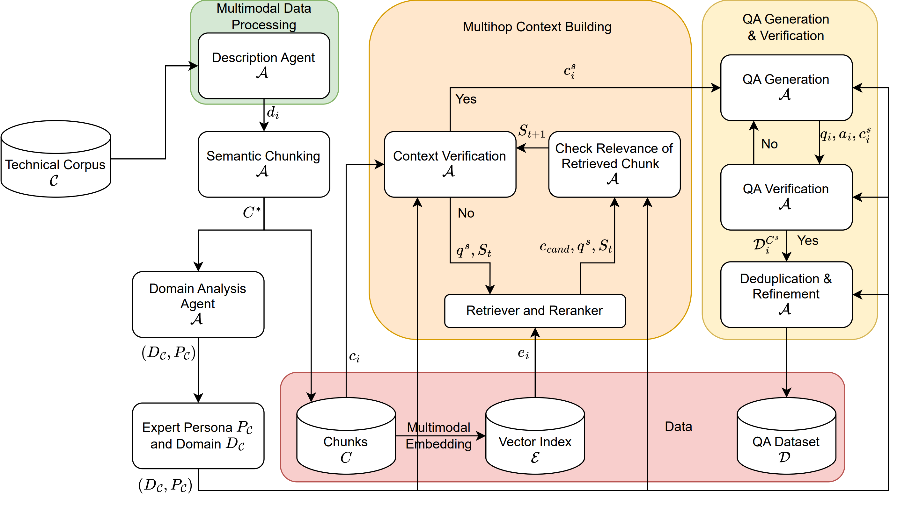

# MiRAGE: A Multiagent Framework for Generating Multimodal Multihop Question-Answer Dataset for RAG Evaluation

<p align="center">
  
  
  
</p>

**MiRAGE** is a multi-agent framework for generating high-quality, multimodal, multihop question-answer datasets for evaluating Retrieval-Augmented Generation (RAG) systems.

### Multiagent Architecture

<p align="center">
  
</p>

### Sample QA Pair

<p align="center">
  
</p>

### Interactive Process Flow

Explore the step-by-step multihop QA generation process:

**[ View Interactive Visualization](https://htmlpreview.github.io/?https://github.com/ChandanKSahu/MiRAGE/blob/main/assets/mirage_qa_gen.html)**

## Key Features

- **Multi-hop Context Completion**: Iteratively expands incomplete chunks with relevant context.
- **Domain and Expert Role Detection**: Automatic domain identification using BERTopic + LLM
- **Multi-stage QA Pipeline**: Generate, Select, Verify, Correct for quality assurance
- **Multimodal Support**: Handles text, tables, figures, and images
- **Multiple Backend Support**: Gemini, OpenAI, and local Ollama models
- **Fully Parallelized**: Thread and process pools for maximum throughput
- **Token Usage Tracking**: Automatic tracking of input/output tokens across all LLM calls
- **Checkpoint & Resume**: Interrupt and resume long-running pipelines without losing progress

## Table of Contents

- [Installation](#installation)
- [Quick Start](#quick-start)
- [Usage](#usage)
- [API Keys Setup](#api-keys-setup)
- [Configuration](#configuration)
- [Command Line Options](#command-line-options)
- [Output Format](#output-format)
- [Project Structure](#project-structure)
- [Contributing](#contributing)
- [License](#license)

## Installation

### From PyPI

```bash
pip install mirage-benchmark
```

### From Source

```bash
git clone https://github.com/ChandanKSahu/MiRAGE.git
cd MiRAGE
pip install -e .
```

### With Optional Dependencies

```bash
pip install mirage-benchmark[eval]  # Evaluation metrics (ragas, langchain)
pip install mirage-benchmark[all]   # All optional dependencies
```

> **Note**: As of v1.2.7, all core dependencies (PDF processing, embeddings, OCR, visualization) are included in the base install. Only evaluation metrics (ragas, langchain) are optional.

### GPU Support (FAISS-GPU)

For GPU-accelerated similarity search, install FAISS-GPU via conda:

```bash
# Create conda environment (recommended)
conda create -n mirage python=3.11
conda activate mirage

# Install FAISS-GPU
conda install -c pytorch faiss-gpu

# Then install MiRAGE
pip install mirage-benchmark
```

## Quick Start

### Step 1: Install the Package

```bash
pip install mirage-benchmark
```

### Step 2: Python Library API (Recommended)

Use MiRAGE directly in your Python scripts - just like HuggingFace Transformers or OpenAI:

```python
from mirage import MiRAGE

# Create and run pipeline
pipeline = MiRAGE(
    input_dir="data/my_documents",
    output_dir="output/my_dataset",
    backend="gemini",
    api_key="your-gemini-api-key",
    num_qa_pairs=50,
)
results = pipeline.run()

# Access results
print(f"Generated {len(results)} QA pairs")
for qa in results:
    print(f"Q: {qa['question']}")
    print(f"A: {qa['answer']}\n")

# Save results
results.save("my_dataset.json")

# Convert to pandas DataFrame
df = results.to_dataframe()
df.to_csv("my_dataset.csv")
```

**Advanced Configuration:**

```python
from mirage import MiRAGE

# Full control over pipeline
pipeline = MiRAGE(
    input_dir="data/papers",
    output_dir="output/papers_qa",
    backend="gemini",
    api_key="your-key",
    num_qa_pairs=200,
    max_depth=3,
    max_breadth=5,
    embedding_model="nomic",        # "auto", "nomic", "bge_m3", "gemini"
    reranker_model="gemini_vlm",    # "gemini_vlm", "monovlm", "text_embedding"
    device="cuda:0",                # "cuda", "cuda:0", "cpu", or None (auto)
    max_workers=8,
    run_deduplication=True,
    run_evaluation=True,
)

# Or load from config file
pipeline = MiRAGE.from_config("config.yaml", num_qa_pairs=100)

# Method chaining
results = pipeline.configure(num_qa_pairs=50).run()
```

**Load existing results:**

```python
from mirage import MiRAGEResults

results = MiRAGEResults.load("output/qa_multihop_pass.json")
print(f"Loaded {len(results)} QA pairs")
df = results.to_dataframe()
```

### Step 3: CLI Usage (Alternative)

You can also use MiRAGE from the command line:

```bash
# Set API key
export GEMINI_API_KEY="your-gemini-key"

# Basic usage
run_mirage --input data/my_documents --output output/my_dataset --num-qa-pairs 10

# With API key as argument
run_mirage -i data/my_documents -o output/my_dataset --backend gemini --api-key YOUR_GEMINI_KEY

# Using OpenAI
run_mirage -i data/my_documents -o output/my_dataset --backend openai --api-key YOUR_OPENAI_KEY

# Using local Ollama (no API key needed)
run_mirage -i data/my_documents -o output/my_dataset --backend ollama

# Generate a config file for full customization
run_mirage --init-config
```

**Note**: When using `--api-key`, always specify `--backend` to indicate which service the key is for.

### Step 5: Check Results

```bash
ls output/my_dataset/
# qa_multihop_pass.json  - Generated QA pairs (always created)
# chunks.json            - Semantic chunks (always created)
# multihop_visualization.html - Interactive visualization (always created)
# embeddings/            - FAISS index and embeddings

# Optional outputs (if --deduplication and --evaluation flags used):
# qa_deduplicated.json   - Deduplicated QA pairs (with --deduplication)
# evaluation_report.json - Quality metrics (with --evaluation)
```

### Quick Test

```bash
# Verify installation
run_mirage --version

# Run preflight checks
run_mirage --preflight

# Generate 1 QA pair for testing
run_mirage --input data/sample --output results/test --num-qa-pairs 1
```

## Usage

### Basic Usage (QA Generation Only)

By default, MiRAGE runs the core pipeline: document processing, chunking, embedding, and QA generation/verification. **Deduplication and evaluation are OFF by default.**

```bash
# Default: Generates QA pairs without deduplication or evaluation
run_mirage --input <INPUT_DIR> --output <OUTPUT_DIR> --num-qa-pairs 100
```

### With Deduplication

To merge similar QA pairs and remove duplicates:

```bash
run_mirage -i data/documents -o output/results --num-qa-pairs 100 --deduplication
```

### With Evaluation Metrics

To compute quality metrics (faithfulness, relevancy, etc.):

```bash
run_mirage -i data/documents -o output/results --num-qa-pairs 100 --evaluation
```

### Full Pipeline (Deduplication + Evaluation)

```bash
run_mirage -i data/documents -o output/results --num-qa-pairs 100 --deduplication --evaluation
```

### With All Options

```bash
run_mirage \
    --input data/documents \
    --output output/results \
    --backend gemini \
    --api-key YOUR_GEMINI_KEY \
    --num-qa-pairs 100 \
    --max-workers 4 \
    --max-depth 2 \
    --embedding-model auto \
    --reranker-model gemini_vlm \
    --deduplication \
    --evaluation \
    --verbose
```

### Auto-Selected Reranker

The reranker is automatically selected based on your backend/API keys:
- **Gemini backend/key** -> Uses Gemini VLM reranker (fast, API-based, uses same model as VLM config)
- **OpenAI backend** -> Uses Gemini VLM if Gemini key available, else MonoVLM
- **No API keys** -> Falls back to MonoVLM (local model, slower)

You can override with `--reranker-model` flag (options: `gemini_vlm`, `monovlm`, `text_embedding`).

**Backend Options:**
- `gemini` (default) - Requires `GEMINI_API_KEY` or `--api-key`
- `openai` - Requires `OPENAI_API_KEY` or `--api-key`
- `ollama` - No API key needed (runs locally)

**Pipeline Steps:**
| Step | Description | Default |
|------|-------------|---------|
| 1. Document Processing | PDF/HTML to Markdown | **Mandatory** |
| 2. Chunking | Semantic chunking | **Mandatory** |
| 3. Embedding | FAISS index creation | **Mandatory** |
| 4. Domain Detection | Expert persona extraction | **Mandatory** |
| 5. QA Generation | Multi-hop QA with verification | **Mandatory** |
| 6. Deduplication | Merge similar QA pairs | OFF (use `--deduplication`) |
| 7. Evaluation | Quality metrics | OFF (use `--evaluation`) |

### Run Preflight Checks

Before running the full pipeline, verify your setup:

```bash
run_mirage --preflight
```

### Using Sample Dataset

```bash
# Prepare sample data (if you have it)
mkdir -p data/sample
cp /path/to/your/documents/*.pdf data/sample/

# Run on sample
run_mirage -i data/sample -o output/sample_results --num-qa-pairs 10
```

## API Keys Setup

### Google Gemini

1. Get API key from: https://makersuite.google.com/app/apikey
2. Set environment variable:
```bash
export GEMINI_API_KEY="your-key-here"
```

Or create a file:
```bash
mkdir -p ~/.config/gemini
echo "your-key-here" > ~/.config/gemini/api_key.txt
```

### OpenAI

1. Get API key from: https://platform.openai.com/api-keys
2. Set environment variable:
```bash
export OPENAI_API_KEY="your-key-here"
```

### Ollama (Local - Free)

No API key needed! Just install Ollama:

```bash
# Install
curl -fsSL https://ollama.com/install.sh | sh

# Start server
ollama serve

# Pull models
ollama pull llama3      # For text
ollama pull llava       # For vision
```

## Configuration

### Using config.yaml

Copy the example config and customize:

```bash
cp config.yaml.example config.yaml
```

Edit `config.yaml`:

```yaml
backend:
  active: GEMINI  # GEMINI, OPENAI, or OLLAMA
  
  gemini:
    api_key_path: ~/.config/gemini/api_key.txt
    llm_model: gemini-2.0-flash
    vlm_model: gemini-2.0-flash
    
  openai:
    api_key_path: ~/.config/openai/api_key.txt
    llm_model: gpt-4o
    vlm_model: gpt-4o
    
  ollama:
    base_url: http://localhost:11434
    llm_model: llama3
    vlm_model: llava

paths:
  input_pdf_dir: data/documents
  output_dir: output/results

qa_generation:
  target_qa_pairs: 100
  max_workers: 4
```

Then run:
```bash
run_mirage --config config.yaml --input data/documents --output output/results
```

**Note**: When installing from pip, you can still use a custom `config.yaml` file. Place it in your working directory or specify the path with `--config`.

### Cost Optimization

MiRAGE uses LLM/VLM APIs extensively. Two operations consume the most tokens:

### 1. Document Processing (PDF/HTML -> Markdown -> Chunks)

**Cost:** High (processes every page with VLM for image/table extraction)

**Recommendation:**
- Only process documents **once** on a curated set of relevant files
- Use `--skip-pdf-processing` and `--skip-chunking` on subsequent runs
- Pre-filter documents to remove irrelevant content before running MiRAGE

```bash
# First run: Process and chunk documents
run_mirage -i data/documents -o output/results --num-qa-pairs 100

# Subsequent runs: Skip processing, only generate QA
run_mirage -i data/documents -o output/results --skip-pdf-processing --skip-chunking --num-qa-pairs 100
```

### 2. Multi-hop Context Building

**Cost:** High (recursive LLM calls to expand context at each depth level)

**Recommendation:**
- Default is now `max_depth: 2` (previously 5)
- Higher depths exponentially increase token usage with diminishing returns
- Depth 2 captures most meaningful cross-document relationships

```yaml
# config.yaml
context:
  max_depth: 2  # Recommended: 2 (default: 5)
```

Use `print_token_stats()` or check the pipeline summary to monitor actual token consumption.

## Command Line Options

| Option | Short | Description | Default |
|--------|-------|-------------|---------|
| `--input` | `-i` | Input directory with documents | Required |
| `--output` | `-o` | Output directory for results | Required |
| `--api-key` | `-k` | API key for LLM backend | From env |
| `--backend` | `-b` | Backend: gemini, openai, ollama | gemini |
| `--model` | | Model name | Auto |
| `--config` | `-c` | Config file path | config.yaml |
| `--init-config` | | Generate a config.yaml in current directory | - |
| `--num-qa-pairs` | | Target QA pairs to generate | 10 |
| `--max-depth` | | Maximum depth for multi-hop retrieval | 2 |
| `--embedding-model` | | Embedding model: `auto`, `qwen3_vl`, `nomic`, `bge_m3` | auto |
| `--reranker-model` | | Reranker model: `gemini_vlm`, `monovlm`, `text_embedding` | auto (based on backend) |
| `--max-workers` | | Parallel workers | 4 |
| `--preflight` | | Run preflight checks only | - |
| `--skip-preflight` | | Skip preflight checks | - |
| `--skip-pdf-processing` | | Skip PDF conversion | - |
| `--skip-chunking` | | Skip chunking step | - |
| `--verbose` | `-v` | Verbose output | - |
| `--version` | | Show version | - |
| `--help` | `-h` | Show help | - |

### Multihop QA Visualization

Explore an interactive visualization of the multihop QA generation process, showing how context chunks are linked through keywords to generate complex questions:

**[ View Interactive Multihop QA Visualization](https://htmlpreview.github.io/?https://github.com/ChandanKSahu/MiRAGE/blob/main/assets/mirage_qa_gen.html)**

The visualization demonstrates:
- Context chunk retrieval and keyword extraction
- Keyword chain relationships across chunks
- Iterative retrieval depth progression
- Final question-answer generation with highlighted concepts

## Output Format

### Generated Files

```
output/my_dataset/
├── markdown/              # Converted markdown files
├── chunks.json           # Semantic chunks
├── qa_dataset.json       # Raw QA pairs
├── qa_deduplicated.json  # Final deduplicated QA pairs
├── evaluation_report.json # Quality metrics
└── run_config.json       # Run configuration
```

### QA Dataset Structure

```json
{
  "chunk_id": 1,
  "question": "What is the company's revenue growth?",
  "answer": "The company achieved 15% revenue growth...",
  "context_chunks": [...],
  "hop_count": 2,
  "relevance_score": "9",
  "difficulty_score": "7",
  "expert_persona": "Financial Analyst",
  "domain": "Finance"
}
```

### Multihop QA Visualization

See the [Interactive Process Flow](#interactive-process-flow) at the top of this page for a step-by-step visualization showing:
- Context chunk retrieval and keyword extraction
- Keyword chain relationships across chunks
- Iterative retrieval depth progression
- Final question-answer generation with highlighted concepts

## Project Structure

```
MiRAGE/
├── src/mirage/                    # Main package
│   ├── __init__.py               # Package initialization
│   ├── main.py                   # Pipeline orchestration
│   ├── cli.py                    # Command-line interface
│   ├── core/                     # Core functionality
│   │   ├── config.py             # Configuration management
│   │   ├── llm.py                # LLM/VLM API interfaces + token tracking
│   │   └── prompts.py            # Prompt templates
│   ├── embeddings/               # Embedding models
│   │   ├── models.py             # Embedding model selection
│   │   ├── rerankers_multimodal.py  # VLM-based reranking
│   │   └── rerankers_text.py     # Text-based reranking
│   ├── pipeline/                 # Processing pipeline
│   │   ├── pdf_processor.py      # PDF to Markdown conversion
│   │   ├── chunker.py            # Semantic chunking
│   │   ├── context.py            # Multi-hop context retrieval
│   │   ├── qa_generator.py       # QA generation and verification
│   │   ├── domain.py             # Domain/expert extraction
│   │   └── deduplication.py      # QA deduplication
│   ├── evaluation/               # Evaluation metrics
│   │   ├── metrics.py            # Standard RAGAS metrics
│   │   └── metrics_optimized.py  # Optimized metrics (faster)
│   └── utils/                    # Utilities
│       ├── preflight.py          # System checks
│       ├── stats.py              # Dataset statistics
│       ├── ablation.py           # Ablation studies
│       ├── checkpoint.py         # Checkpoint/resume support
│       ├── llm_cache.py          # LLM response caching
│       ├── visualize_multihop.py # Multihop QA visualization
│       └── visualize_pipeline.py # Pipeline flow visualization
├── data/documents/               # Input documents folder
├── output/                       # Generated results
├── assets/                       # Documentation images
├── config.yaml.example           # Example configuration
├── run_mirage.py                 # Main entry point script
├── setup.py                      # Package installation
├── pyproject.toml                # Package configuration
├── requirements.txt              # Dependencies
├── README.md                     # This file
├── CONTRIBUTING.md               # Contribution guidelines
└── LICENSE                       # Apache 2.0 License
```

## Python API

For programmatic access, you can import and use MiRAGE modules directly:

```python
# Import the main pipeline
from mirage import run_pipeline
# Or import specific components
from mirage.core.llm import call_llm_simple, call_vlm_interweaved
from mirage.pipeline.context import build_complete_context
from mirage.pipeline.qa_generator import generate_qa, verify_qa
from mirage.pipeline.domain import fetch_domain_and_role
from mirage.embeddings.models import NomicVLEmbed, get_best_embedding_model
from mirage.utils.preflight import run_preflight_checks

# Example: Run preflight checks
success, results = run_preflight_checks()

# Example: Call LLM
response = call_llm_simple("What is 2+2?")

# Example: Use embedding model
embedder = NomicVLEmbed()
embedding = embedder.encode("Sample text")

# Example: Track token usage
from mirage.core.llm import get_token_stats, print_token_stats, reset_token_stats

# After running LLM calls, check token usage
stats = get_token_stats()
print(f"Input tokens: {stats['total_input_tokens']}")
print(f"Output tokens: {stats['total_output_tokens']}")

# Print formatted summary
print_token_stats()

# Reset counters for a new run
reset_token_stats()
```

See the module docstrings for detailed API documentation.

## Examples

### Generate QA from PDFs

```bash
# Using Gemini
export GEMINI_API_KEY="your-key"
run_mirage -i data/pdfs -o output/qa_dataset --num-qa-pairs 100

# Using OpenAI  
export OPENAI_API_KEY="your-key"
run_mirage -i data/pdfs -o output/qa_dataset --backend openai --num-qa-pairs 100

# Using Ollama (local, free)
run_mirage -i data/pdfs -o output/qa_dataset --backend ollama --num-qa-pairs 100
```

### Generate More QA Pairs

```bash
run_mirage -i data/documents -o output/large_dataset --num-qa-pairs 500
```

### Use More Workers

```bash
run_mirage -i data/documents -o output/fast_run --max-workers 8 --num-qa-pairs 100
```

### Skip Already Processed Steps

```bash
# If you already have markdown files
run_mirage -i data/documents -o output/results --skip-pdf-processing --num-qa-pairs 100

# If you already have chunks
run_mirage -i data/documents -o output/results --skip-chunking --num-qa-pairs 100
```

### Custom Models

```bash
# Use specific embedding model
run_mirage -i data/documents -o output/results \
  --embedding-model nomic --num-qa-pairs 100

# Use specific reranker
run_mirage -i data/documents -o output/results \
  --reranker-model monovlm --num-qa-pairs 100

# Custom multi-hop depth
run_mirage -i data/documents -o output/results \
  --max-depth 3 --num-qa-pairs 100
```

## Troubleshooting

### Command Not Found

If `run_mirage` command is not found after pip installation:

```bash
# Check if package is installed
pip show mirage-benchmark

# Reinstall if needed
pip install --upgrade mirage-benchmark

# Verify installation
run_mirage --version
```

### API Key Issues

```bash
# Check if API key is set
echo $GEMINI_API_KEY  # or $OPENAI_API_KEY

# Set it if missing
export GEMINI_API_KEY="your-key"
```

### Preflight Check Failures

```bash
# Run verbose preflight
run_mirage --preflight --verbose
```

### Import Errors (Development)

If you're developing from source and encounter import errors:

```bash
# Reinstall in editable mode
pip install -e .

# Or run directly with PYTHONPATH
PYTHONPATH=src python src/mirage/run_mirage.py --help
```

## Contributing

1. Fork the repository
2. Create a feature branch
3. Make your changes
4. Submit a pull request

See [CONTRIBUTING.md](CONTRIBUTING.md) for details.

## Citation

```bibtex
@misc{sahu2026miragemultiagentframeworkgenerating,
      title={MiRAGE: A Multiagent Framework for Generating Multimodal Multihop Question-Answer Dataset for RAG Evaluation}, 
      author={Chandan Kumar Sahu and Premith Kumar Chilukuri and Matthew Hetrich},
      year={2026},
      eprint={2601.15487},
      archivePrefix={arXiv},
      primaryClass={cs.AI},
      url={https://arxiv.org/abs/2601.15487}, 
}
```

## License

Apache License 2.0 - see [LICENSE](LICENSE)


